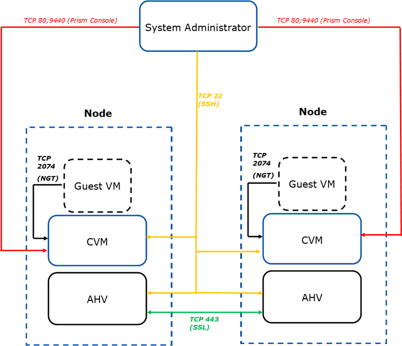

# 3. Network Requirements

### 3.1   IP Address Considerations


Nutanix recommends using static IP addresses for all nodes and CVMs. If the customer uses a DHCP server, ensure the assigned IP addresses are excluded from the DHCP pool.


You need to reserve two (2) IP addresses for **each** node in the cluster. The first IP is for the node itself, and the second is for the CVM that will run on that node.

Nutanix recommends using the 10.x.x.x or 172.x.x.x IP address schemes. Use the Network Information Checklist in the appendix to record this information before the install.


Community Edition reserves the IP range 192.168.5.1 through 192.168.5.254 for internal communication between nodes. Ensure the customer is not using this range for any other device on the network!


### 3.2 Firewall Considerations

The following table outlines which firewall ports must be open for Community Edition to communicate properly.

_Table 3-1: Firewall Port Requirements_

| SSH to both CVM and hypervisor                                                       | TCP 22       |
| ------------------------------------------------------------------------------------ | ------------ |
| NTP Service                                                                          | UDP 123      |
| Prism Web Console                                                                    | TCP 80; 9440 |
| Cluster remote support                                                               | TCP 80; 443  |
| Nutanix Pulse (a service which sends cluster alerts and usage statistics to Nutanix) | TCP 8443     |
| Nutanix Guest Tools (NGT) communication between guest VM and CVM                     | TCP 2074     |

_Source: Nutanix. (2020). “Recommendation on Firewall Ports Config, KB 1478”, “Getting Started with Nutanix Community Edition”_

_Figure 3-1: Basic communication diagram_

<figure><figcaption></figcaption></figure>
