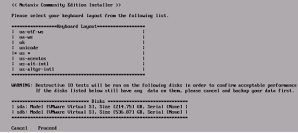
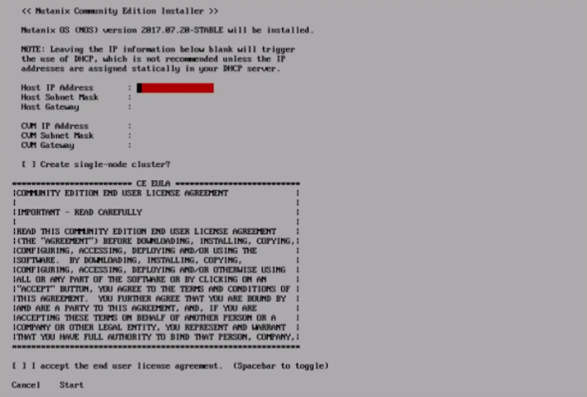
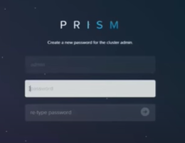
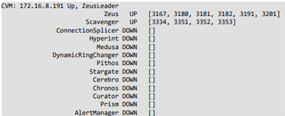

# 5. Deployment

Before proceeding, ensure the node’s boot device is set to USB in BIOS (if you are using a USB boot device). Typically, you will need to press a function key or the escape key to enter the BIOS settings. The hotkey needed typically displays during POST. If it does not, consult the hardware vendor instruction manual.

### 5.1  Installation Procedure 


&#x20;The deployment process destroys any pre-existing data on all drives!


1\. Insert the USB stick and power on the node. The machine should boot to the image loaded on the USB drive.

2\. When prompted, enter **install** as the username, and leave the password blank.

3\. Select the appropriate keyboard layout using the arrow keys.

4\. Read the warning about the destructive testing and use tab to select “Proceed.”

5\. Press “Enter” to proceed with installation.

_Figure 5-1: Initial Install Screen_

<figure><figcaption>
Source: Nutanix. (2020). “Getting Started with Nutanix Community Edition”
</figcaption></figure>

6\. Enter the IP address, subnet mask and gateway information for the node (host) and the CVM. Use the Tab or arrow keys to go to the next field.

7\. Use the space bar to select “Create a Single Node Cluster” if applicable.


If you are creating a single-node cluster, the installer will also prompt you to enter a Domain Name Service (DNS) server IP. If the customer does not have an internal DNS server, you can use an IP from a public DNS service such as Google Public DNS (8.8.8.8 or 8.8.4.4) (Google, LLC, n.d.)


&#x20;8\. Accept the End User License Agreement (EULA).

9\. Use Tab to highlight “Start,” and press “Enter.”

_Figure 5-2: Post-Install Configuration_

<figure><figcaption>
Source: Nutanix. (2020). “Getting Started with Nutanix Community Edition”
</figcaption></figure>

When the installation completes, you will see a “Imaging Process Completed Successfully” message. The CVM will then start. Please allow about 5 minutes for all CVM services to start.

10\. Open a web browser and enter the IP of the CVM. The management console will display:

_Figure 5‑3: Prism Element Initial Login Screen_

<figure><figcaption>
Source: Nutanix. (2020). “Getting Started with Nutanix Community Edition”
</figcaption></figure>

11\. Enter the default password of **nutanix/4u**. The system will prompt you to change it. Have the customer enter a secure password of his/her choice.

12\. Have the customer enter his/her NEXT credentials to finish registering the cluster. This is the account created in section 4.


See[ “Default Nutanix passwords”](appendix.md#default-nutanix-passwords) in the appendix for a list of default passwords for various components of the Nutanix system. <mark style="color:red;">**All default passwords are well known and should be changed after deployment.**</mark> The appendix also contains instructions on [how to change these passwords.](appendix.md#how-to-change-nutanix-passwords)


\
13\. At the login prompt shown after installing Community Edition, log into the node. The username is **root** and the default password is **nutanix/4u**.

14\. Log into the CVM via secure shell (SSH). The username is **nutanix**, and the default password is **nutanix/4u**.

### 5.2   Cluster Configuration

Use the procedure outlined in [Section 5-1 “Installation Procedure”](5.-deployment.md#\_toc63438100) to deploy the Nutanix software to the remaining nodes in the intended cluster before proceeding with cluster configuration.

&#x20;


If you are creating a multi-node cluster, skip to [_5.2.2 “Creating a Multi-Node Cluster.”_](5.-deployment.md#\_toc63438103)


#### 5.2.1   Creating a Single-Node Cluster

1\. Connect to the CVM using SSH.

2\. Create the cluster by entering the following command, where **cvm\_ip** is the CVM’s IP address:

`cluster -s cvm_ip --redundancy_factor=1 create`

A series of messages informs you that the cluster is being created and services are starting. When the process is finished, a “cluster created message” is displayed.

3\. Configure one or more DNS servers by entering the following command, where `dns_server` is either a single IP, or a comma-separated list of multiple IPs:

`ncli cluster add-to-name-servers servers="dns_server"`

You can specify either internal DNS IP addresses, or use a public DNS service such as Google Public DNS (8.8.8.8 and 8.8.4.4).

4\. Verify the configuration:

`ncli cluster get-name-servers`

(Nutanix, Inc., 2020)

#### 5.2.2   Creating a Multi-Node Cluster 


You will need another IP address, which Nutanix calls the “external IP address,” to use as the cluster IP. This IP is used to access Prism, the management interface for the cluster. Nutanix recommends using a static IP for the external IP.

Despite its name, the external IP should be LAN-facing only, and NOT accessible from the internet.


1\. Connect to a CVM using SSH.

2\. Create the cluster by entering the following command, where `cvm_ip_addresses` is a comma-separated list of all the CVM IP addresses that will be part of the cluster:

`cluster -s cvm_ip_addresses create`

3\. Start your new cluster:

`cluster start`

A series of messages should display, indicating a status of UP for each node in the cluster.

**5.2.2.1  Configure Cluster**

1\. Define the name of the cluster by entering the following command, where `cluster_name` is the desired cluster name:

`ncli cluster edit-params new-name=cluster_name`

2\. Configure one or more DNS servers using the following command, where `dns_server` is a single DNS server, or a comma-separated list of servers:

`ncli cluster add-to-name-servers servers="dns_server"`

3\. Confirm the new DNS settings:

`ncli cluster get-name-servers`

4\. Configure Network Time Protocol (NTP) servers, where `ntp_server` is a single NTP server, or a comma-separated list of servers. You can use the customer’s internal NTP servers (if applicable), or external sources such as the time.nist.gov NTP server pool:

`ncli cluster add-to-ntp-servers servers="ntp_server"`

5\. Configure the external IP (cluster IP), where `cluster_ip_address` is the cluster IP:

`ncli cluster set-external-ip-address \ external-ip address="cluster_ip_address"`

(Nutanix, Inc., 2020)

#### 5.2.3   Destroying a Cluster

Destroying a cluster resets all nodes to the state they were in before the cluster was created. This process also destroys all guest VMs.

Cluster destruction is necessary if the customer wants to move from a single-node to a multi-node cluster, or if the customer is finished using Community Edition and wants to re-purpose the hardware for another application.


Destroying a cluster also destroys all guest VMs. Ensure the customer has backed up any needed VMs or data because this process is irreversible!


1\. Connect to a CVM using SSH.

2\. Stop the cluster by running the following command:

`cluster stop`

&#x20;3\. Wait until output like the following is displayed for every CVM:

&#x20;_Figure 5 -10: Cluster Stop Output_

<figure><figcaption>
Source: Nutanix. (2020). “Getting Started with Nutanix Community Edition”
</figcaption></figure>

4\. Destroy the cluster using the following command:

`cluster -f destroy`
